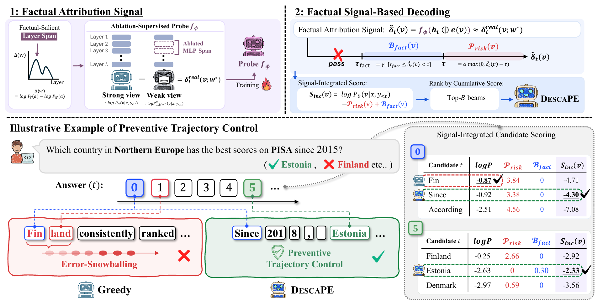

# DESCAPE

[](https://arxiv.org/abs/2609.15745)

📢 **[Sep 2026]** DESCAPE was accepted to **Findings of EMNLP 2026**.

Official implementation of **"Look Before You Leap: Factual Decoding with Internal Attribution Signals"**.

DESCAPE (**DE**coding **S**ignal **C**ontrol **A**gainst **P**ath **E**rror-snowballing) is a decoding framework that suppresses hallucination-prone trajectories at inference time. It reads a factual attribution signal from inside the model, and uses it during beam search to penalize high-risk continuations and reward factually grounded ones, before an early factual error can snowball through the rest of the generation.

DESCAPE does not modify the base model and needs no external verifier. In our experiments on five factuality benchmarks and three LLMs, it improves factuality over decoding-time baselines in multiple settings, at 1.10× the latency of greedy decoding.

This repository contains the decoding code, the trained probes for three LLMs, the scripts to build a probe for a new model, and the evaluation scripts.

## 💡 How DESCAPE works

<p align="center">
  
</p>

**Factual attribution signal.** Sliding-window MLP ablation identifies a contiguous span of layers, the *factual-salient layer span*, whose MLPs are selectively engaged in factual generation. The signal of a candidate token `v` is the drop in its log-probability when the MLPs in this span are zeroed out:

```
δ_real(v) = log p(v | x, y<t) − log p_abl(v | x, y<t)
```

This signal is elevated for factual tokens such as answers, entities, and numbers, stays near zero for function words, and shows abnormal spikes at hallucinated tokens.

**Probe.** Computing `δ_real` needs a second, ablated forward pass at every step. A lightweight probe `f_φ` instead estimates it from a single forward pass, taking the hidden state at the last layer of the span concatenated with the embedding of the candidate token.

**Signal-integrated decoding.** At each step, every candidate token is scored with its estimated signal `δ̂(v)`:

```
S_inc(v) = log p(v | x, y<t) − α · max(0, δ̂(v) − τ) + γ · 1[τ_fact ≤ δ̂(v) < τ]
```

| Zone | Condition | Effect |
|------|-----------|--------|
| Risk | `δ̂(v) ≥ τ` | Penalized in proportion to the excess over `τ` |
| Factual | `τ_fact ≤ δ̂(v) < τ` | Rewarded with a bonus `γ` |
| Safe | `δ̂(v) < τ_fact` | Unchanged |

The top-`B` beams are kept by cumulative score with duplicate sequences removed, and the final sequence is selected with length normalization.

## 🔧 Setup

```bash
pip install -r requirements.txt
```

Tested with Python 3.12, PyTorch 2.9, and Transformers 4.57. A CUDA GPU with 24GB of memory is enough for the three 7-8B models. `openai` is needed only for the LLM-as-judge [evaluation](#-benchmarks-and-evaluation).

## 🚀 Quick Start

Answer a single question:

```bash
python generate.py \
  --model meta-llama/Llama-3.1-8B-Instruct \
  --probe llama \
  --question "Which country in Northern Europe has the best scores on PISA since 2015?"
```

Run a benchmark:

```bash
python generate.py \
  --model meta-llama/Llama-3.1-8B-Instruct \
  --probe llama \
  --dataset truthfulqa \
  --output_path outputs/truthfulqa_llama.json
```

The base model is downloaded from the Hugging Face Hub, and the probes are included in this repository.

### Models

| Model | `--model` | `--probe` | Factual-salient layer span |
|-------|-----------|-----------|:--------------------------:|
| Llama-3.1 | `meta-llama/Llama-3.1-8B-Instruct` | `llama` | 12–18 |
| Mistral-v0.3 | `mistralai/Mistral-7B-Instruct-v0.3` | `mistral` | 20–26 |
| Qwen2.5 | `Qwen/Qwen2.5-7B-Instruct` | `qwen` | 12–18 |

The probes are stored in `checkpoints/probe_{llama,mistral,qwen}.pt` (about 8MB each). `--probe` also accepts a path to a probe trained with `train_probe.py`.

### Arguments

| Argument | Default | Description |
|----------|---------|-------------|
| `--model` | (required) | Hugging Face model ID or local path of the base LLM |
| `--probe` | (required) | Released probe name or path to a probe checkpoint |
| `--dataset` | `truthfulqa` | `truthfulqa`, `freshqa`, `factscore`, `nq`, or `triviaqa` |
| `--question` | None | Answer a single question instead of running a benchmark |
| `--beam_width` | 5 | Number of beams `B` |
| `--candidates_per_beam` | 12 | Candidates `K` scored per beam |
| `--alpha` | 0.5 | Risk penalty weight `α` |
| `--tau` | 3.0 | Risk threshold `τ` |
| `--gamma` | 0.3 | Factual bonus weight `γ` |
| `--tau_fact` | 0.5 | Lower bound of the factual zone `τ_fact` |
| `--length_penalty` | 0.6 | Length normalization exponent `λ` |
| `--num_sample` | per benchmark | Number of samples |
| `--log_path` | None | Write a detailed per-step decoding log |

Prompt templates and length limits of each benchmark are defined in `descape/tasks.py`.

### Output

Results are saved to `--output_path` as a JSON file:

| Key | Description |
|-----|-------------|
| `results` | Per-sample question, prediction, gold answers, and latency |
| `metrics` | EM and token-level F1 (NQ and TriviaQA only) |
| `statistics` | Total tokens, decoding time, forward passes, and early stops |
| `config` | Decoding hyperparameters |

### Implementation

| File | Purpose |
|------|---------|
| `descape/decoder.py` | `DescapeDecoder`: batched candidate scoring, signal-integrated beam search, deduplication, length normalization, and early stopping |
| `descape/probe.py` | Probe architecture (three-layer MLP) and checkpoint loading |
| `descape/tasks.py` | Benchmark loaders and prompt templates |

## 📊 Benchmarks and Evaluation

| Benchmark | `--dataset` | Data | Metrics |
|-----------|-------------|------|---------|
| TruthfulQA | `truthfulqa` | Downloaded automatically | Truth, Info, Truth\*Info |
| FreshQA | `freshqa` | Pass the FreshQA csv with `--data_path` | Strict and relaxed accuracy |
| FActScore | `factscore` | Pass `prompt_entities.txt` (500 entities) with `--data_path` | FActScore |
| NQ | `nq` | Downloaded automatically | EM, F1, SoftEM |
| TriviaQA | `triviaqa` | 3,000 validation questions, downloaded automatically | EM, F1, SoftEM |

The LLM-as-judge evaluations use GPT-4o-mini and read the API key from the `OPENAI_API_KEY` environment variable.

```bash
export OPENAI_API_KEY=...

# TruthfulQA
python evaluation/truthfulqa_eval.py \
  --input outputs/truthfulqa_llama.json \
  --output outputs/truthfulqa_llama_eval.json

# FreshQA (uses the FreshEval prompts from the official repository)
git clone https://github.com/freshllms/freshqa
python evaluation/freshqa_eval.py \
  --input outputs/freshqa_llama.json \
  --output outputs/freshqa_llama_strict.json \
  --freshqa-dir freshqa --mode strict

# NQ and TriviaQA
python evaluation/short_answer_eval.py --input outputs/triviaqa_llama.json
```

For FActScore, the entity list `data/unlabeled/prompt_entities.txt` comes with the data of the official [FActScore](https://github.com/shmsw25/FActScore) package. `generate.py` writes `outputs/<name>.jsonl` next to the JSON file, in the input format of that package, which we use for scoring.

```bash
python generate.py \
  --model meta-llama/Llama-3.1-8B-Instruct --probe llama \
  --dataset factscore --data_path /path/to/prompt_entities.txt \
  --output_path outputs/factscore_llama.json
```

## 🧩 Building a Probe for a New Model

The three stages below produce a probe for any decoder-only LLM whose layers are accessible as `model.model.layers[i].mlp`.

**1. Identify the factual-salient layer span.** Each candidate window of layers is ablated in turn, and the window with the highest Factual Attribution Score `Δ(w)` on correctly answered TriviaQA questions is selected.

```bash
python find_layer_span.py \
  --model meta-llama/Llama-3.1-8B-Instruct \
  --output_path outputs/layer_span_llama.json
```

**2. Collect supervision targets.** The model generates answers to Databricks Dolly-15k questions while a second KV cache tracks the ablated model, which gives `δ_real` for the top-10 candidates at every step without extra forward passes.

```bash
python collect_labels.py \
  --model meta-llama/Llama-3.1-8B-Instruct \
  --layer_span 12-18 \
  --num_sample 1000 \
  --output_path labels/labels_llama.pt
```

**3. Train the probe.** The checkpoint with the best validation Spearman correlation is saved as `probe_best.pt`.

```bash
python train_probe.py \
  --model meta-llama/Llama-3.1-8B-Instruct \
  --labels_path labels/labels_llama.pt \
  --save_dir checkpoints/llama_new
```

Then decode with `--probe checkpoints/llama_new/probe_best.pt`. The released probes use 1,000 labeling samples for Llama-3.1 and 3,000 for Mistral-v0.3 and Qwen2.5.

## 📁 Repository Structure

```
DESCAPE/
├── generate.py            # decode a question or a benchmark with DESCAPE
├── descape/               # decoder, probe, and benchmark definitions
├── checkpoints/           # released probes (Llama-3.1, Mistral-v0.3, Qwen2.5)
├── find_layer_span.py     # sliding-window MLP ablation
├── collect_labels.py      # probe supervision targets
├── train_probe.py         # probe training
├── evaluation/            # TruthfulQA, FreshQA, and short-answer QA evaluation
├── docs/figs/
└── requirements.txt
```

## 🔗 Related Sources

- [TruthfulQA](https://github.com/sylinrl/TruthfulQA) - Benchmark for truthfulness in open-ended question answering
- [FreshQA](https://github.com/freshllms/freshqa) - Dynamic QA benchmark with the FreshEval protocol
- [FActScore](https://github.com/shmsw25/FActScore) - Fine-grained factual precision for long-form generation
- [Databricks Dolly-15k](https://huggingface.co/datasets/databricks/databricks-dolly-15k) - Instruction-following data used to train the probes

## Citation

```bibtex
@misc{ryu2026descape,
  title={Look Before You Leap: Factual Decoding with Internal Attribution Signals},
  author={Hayeong Ryu and JungMin Yun and Byeonggeuk Lim and Sunhee Jo and YoungBin Kim},
  year={2026},
  eprint={2609.15745},
  archivePrefix={arXiv},
  primaryClass={cs.CL},
  url={https://arxiv.org/abs/2609.15745}
}
```
